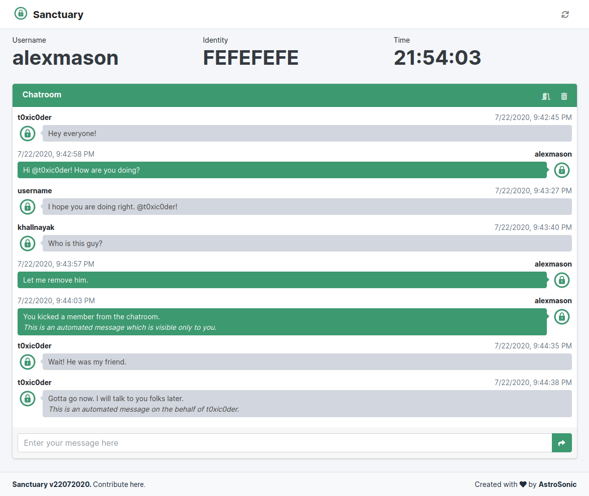
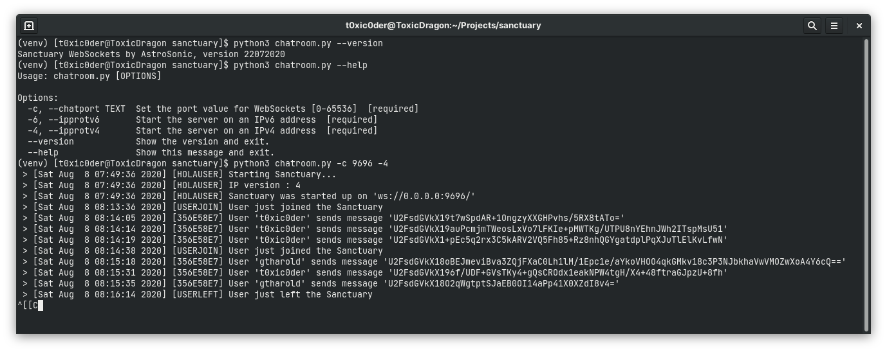

<h1 align="center">sanctuary</h1>
<p align="center">A secure synchronous lightweight chatroom with zero logging and total transience</p>

<p align="center">
    
    
    
    
</p>

## Simply elegant


## Built on
* **WebSockets** for *low-level real-time, bidirectional and event-based communications*
* **Flask** for *web backbone, complex scalability and WSGI layer*
* **Click** for *creating beautiful command line interfaces in a composable way*

## Features
* Provides real-time conversation using synchronous WebSocket objects
* Ultralight on system resources - Approx. 2MB over Python runtime
* Zero logging or data storage to minimize database vulnerabilities
* Accessible across internet with both IPv4 and IPv6 support by-design
* No-frills user alias and random-generated keys for chatroom creation
* Hardened protection using password-based AES message encryption
* Leave the chatroom (with farewell) using the dedicated `/exit` call
* Purge the chatroom for every member using the dedicated `/stop` call
* Kick specific members from chatroom using the dedicated `/kick` call
* Whisper messages to specific members using the dedicated `/purr` call
* Refresh, close tab, logout, kick users or purge chatroom to cover tracks
* Transient chatrooms stay valid as long as at least one user is present
* Complete support for HTML5 formatting tags in conversations
* Lightweight and responsive - hence, usable across multiple devices
* State-of-the-art active chatroom and user session management

## Compatibility
This has been tested to work on
1. Generic PCs (`x86_64`)
    - Fedora, Ubuntu, Arch Linux ARM and Debian have been tested.
2. Raspberry Pi 4B (`aarch64`, `armhf`)
    - Arch Linux ARM, Raspberry Pi OS, Raspberry Pi OS Lite, DietPi, Manjaro ARM and Ubuntu ARM have been tested.
3. Raspberry Pi 3B and 3B+ (`aarch64`, `armhf`)
    - Arch Linux ARM, Raspberry Pi OS, Raspberry Pi OS Lite, DietPi and Ubuntu ARM have been tested.
4. Raspberry Pi Zero W (`armv6`)
    - Arch Linux ARM, Raspberry Pi OS, Raspberry Pi OS Lite and DietPi have been tested.

There are a lot of GNU/Linux distributions I could not test for - due to the lack of time and the amount of effort it takes to test it all everywhere. Though, it is worth noting that any GNU/Linux distribution based on the ones listed above should inherently work.

## Usage
- Install `python3` and `pip` with your GNU/Linux distribution-specific package managers.
- Install and upgrade **virtualenv** if not already done.
```shell script
$ pip3 install virtualenv --user
```
- Clone the repository on your local storage and make it your current working directory.
```shell script
$ git clone https://github.com/astrosonic/sanctuary.git
$ cd sanctuary
```
- Create a virtual environment.
```shell script
$ virtualenv venv
```
- Activate the virtual environment.
```shell script
$ source venv/bin/activate
```
- Install all dependencies for the project.
```shell script
(venv) $ pip3 install -r requirements.txt
```
- Run the *Sanctuary Chatroom Server* with the tweakable options shown below.
```shell script
(venv) $ python3 servchat.py --version
Sanctuary Chatroom by AstroSonic, version 22072020
```
```shell script
(venv) $ python3 servchat.py --help
Usage: servchat.py [OPTIONS]

Options:
  -s, --servport TEXT  Set the port value for Chatroom [0-65536]  [required]
  -c, --chatport TEXT  Set the port value for WebSockets [0-65536]  [required]
  -6, --ipprotv6       Start the server on an IPv6 address  [required]
  -4, --ipprotv4       Start the server on an IPv4 address  [required]
  --version            Show the version and exit.
  --help               Show this message and exit.
```
```shell script
(venv) $ python3 servchat.py -s 6969 -c 9696 -4
```

- Open another terminal in the same directory of the cloned repository and activate the virtual environment there too.
```shell script
$ source venv/bin/activate
```
- As requirements were already met in the previous steps for this virtual environment, simply run the *Sanctuary WebSockets Server* with the tweakable options shown below.
```shell script
(venv) $ python3 chatroom.py --version
Sanctuary WebSockets by AstroSonic, version 22072020
```
```shell script
(venv) $ python3 chatroom.py --help
Usage: chatroom.py [OPTIONS]

Options:
  -c, --chatport TEXT  Set the port value for WebSockets [0-65536]  [required]
  -6, --ipprotv6       Start the server on an IPv6 address  [required]
  -4, --ipprotv4       Start the server on an IPv4 address  [required]
  --version            Show the version and exit.
  --help               Show this message and exit.
```
```shell script
(venv) $ python3 chatroom.py -c 9696 -4
```

- Keep in mind that the IP version must be the same for both the chatroom and websockets servers. For instance - If you want your chatroom to function on IPv6 - provide `-6` suffix to both of the servers.
- Also note that the arguments for the chatroom server (that is after `-s` suffix and `-c` suffix) must be different as the port numbers that you provide for chatroom and websocket servers would otherwise conflict.
- The argument for the websockets server (the one after `-c` suffix) should be the same as that argument for the chatroom server (the one after `-c` suffix).
- Make a note of your device's IP address - keeping in mind the IP version you chose while initiating the servers and ensure if your device is reachable in your network.
- To access the chatroom,
    - Devices in your network can simply head over to ```http://<YOUR-LOCAL-IP-ADDRESS>:6969/``` on a web browser.
    - To ensure that the server is discoverable across the internet, enable port forwarding or use the IPv6 mode.
    - Simply replace the port number provided here with the one that you provided while initiating the chatroom server - Specifically the one after the `-s` suffix.
    - The IPv6 mode is natively supported though it is really upto your internet service provider if IPv6 addresses are made available to you or not.
- Playing around with the chatroom, you can
    - Enter the chatroom by typing in your alias and generating a chatroom identity.
    - Keep a copy of the identity as that is how your friends can join this chatroom.
    - Let your friend join the chatroom by entering in their alias and your chatroom identity.
    - Begin easy conversation and experiment with the HTML5 rendering support.
        - You can add images to your conversation using `````` tags.
        - You can emphasise on important texts by using ```<h1>, <h2>, ...``` header tags.
        - You can embed code to your conversation by using ```<code>``` tags.
        - There are a lot of more exciting things you can do with the HTML5 rendering!
    - Get more people on board by sharing the chatroom key. Once you do, you can
        - Whisper confidential messages to specific users by typing in ```/purr <USERNAME> <MESSAGE>``` and pressing ```[ENTER]```. The message would then be shared only to the expected recipient and not to anyone else.
        - Remove unwanted users by typing in ```/kick <USERNAME>``` and pressing ```[ENTER]```. This capability is shared by everyone so discretion is advised.
        - Purge the entire chatroom by removing all the users and chat records from all ends by typing in ```/stop``` and pressing ```[ENTER]```. Even this capability is shared by everyone so discretion is advised.
        - Say goodbye and leave the chatroom by typing in ```/exit``` and pressing ```[ENTER]```. You can of course close your tab or move away to another URL but then you miss your chance of a proper farewell.
        - There are a lot of more ways to handle the group conveniently with just keystrokes!
- Once you are done with the servers, head back to the terminals and press ```[Ctrl+C]``` to stop the servers.
- When done tinkering, deactivate the virtual environment in both the terminals.
```shell script
(venv) $ deactivate
```
- Give stars to the repository if you found it useful.

## Vulnerabilities
<p align="justify">As most of the functions and routines have been implemented on the client-side to reduce the weight and complexity of the server-side code, the chatroom is vulnerable to monkey patching. Though the risk of information breach has been significantly minimized with the introduction of AES-based hardened protection, still it is highly recommended not to share confidential and sensitive information over the chatrooms. In such a state, it can be used for all kinds of conversation and as long as the chatroom is not opened up to the internet, you should not have to worry about any vulnerabilities.</p>

## Disclaimer
<p align="justify">When you use Sanctuary - you agree to not hold its contributors responsible for any data loss or breach that may occur due to the use of this chatroom application. You agree that you are aware of the experimental condition of Sanctuary and that you would want to use it at your own risk.</p>

## Contribute
<p align="justify">You may request for the addition of new features in the <a href="https://github.com/t0xic0der/sanctuary/issues">issues</a> page but as the project is singlehandedly maintained - it might take time to develop on them. Please consider forking the repository and contributing to its development. :heart:</p>
