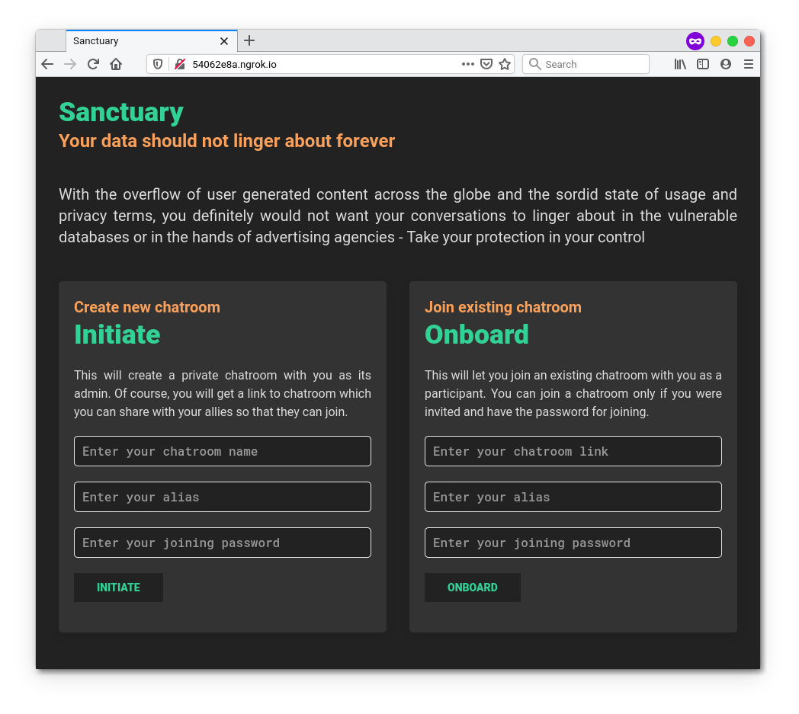
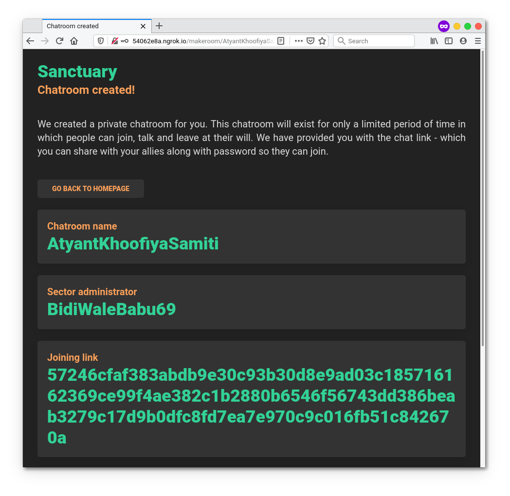
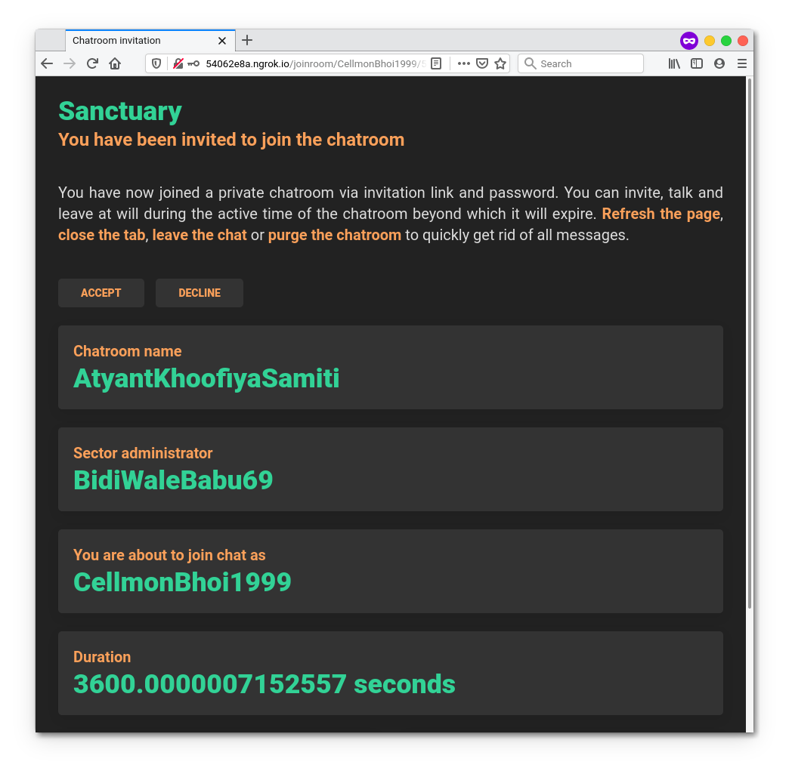
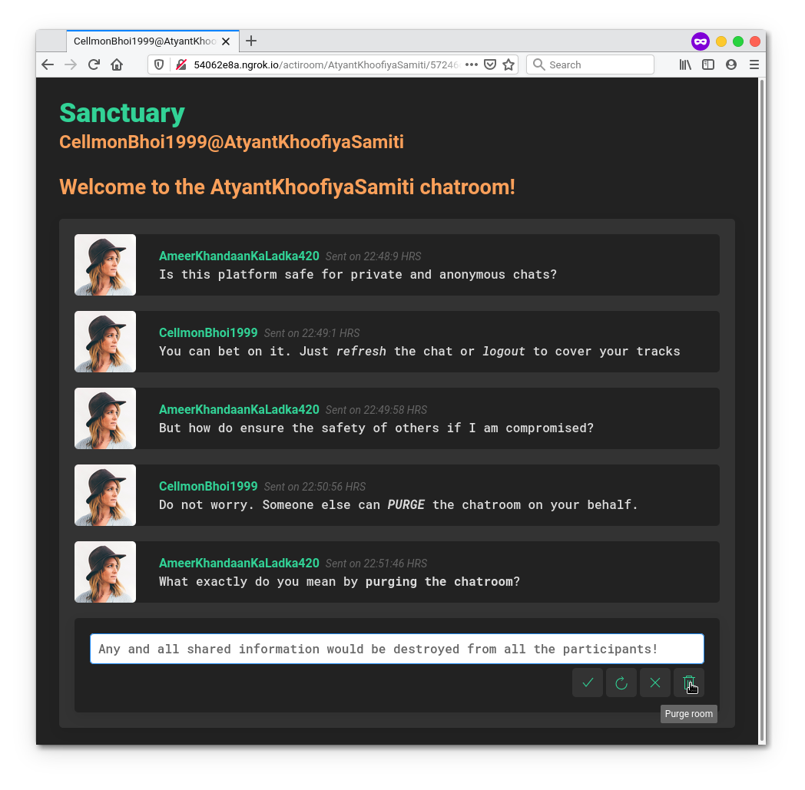
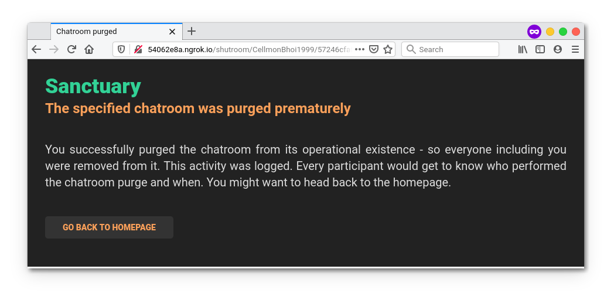
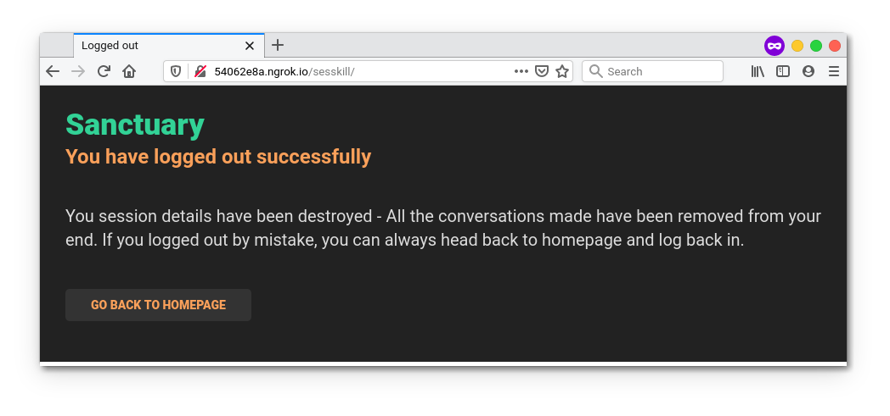
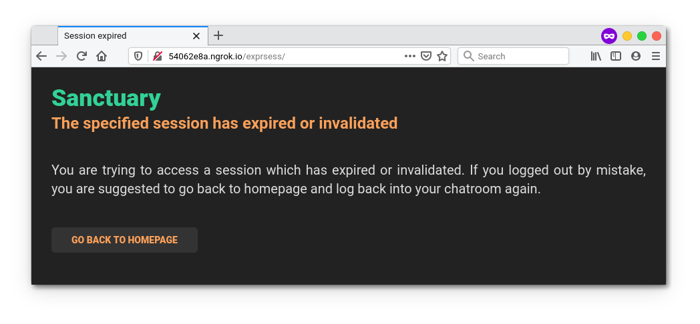

# sanctuary
A secure synchronous lightweight chatroom with zero logging and total transience

## Built on
* **Socket.IO** for *real-time, bidirectional and event-based communication*
* **Flask** for *web backbone, complex scalability and WSGI layer*
* **Hashing techniques** for *password protection, identification and authentication*

## Salient features
* Provides real-time conversation using synchronous sockets
* Zero logging or data storage to minimize vulnerabilities
* No-frills alias and password-protected chatroom creation
* Refresh, close tab, logout or purge chatroom to cover tracks
* Transient chatrooms stay valid for 60 minutes before auto-purge
* Complete support for HTML5 formatting tags in conversations
* Lightweight and responsive so usable across multiple devices
* State-of-the-art chatroom user session management

## Usage 
1.  Install and upgrade **virtualenv** if not already done by executing ```pip3 install virtualenv --user```
2.  Clone the repository on your local drive and make it your current working directory.
3.  Create a virtual environment by executing ```virtualenv venv```
4.  Activate the virtual environment by executing ```source venv/bin/activate```
5.  Install all dependencies for the project by executing ```pip3 install -r requirements.txt```
6.  Run the project server by executing ```python3 main.py```
7.  Open up a web browser and head over to ```http://0.0.0.0:6969/```
    1. Devices in your network can reach out by visiting ```http://<YOUR-LOCAL-IP-ADDRESS>:6969/```
    2. To make sure the server is discoverable across internet, enable port forwarding
8.  Play around with creating and joining rooms using room identification key
    1. Create chatrooms using ```INITIATE``` - Add your chatroom name, user alias and joining password to begin with
    2. Join chatrooms using ```ONBOARD``` - Join created chatrooms with chatroom ID, user alias and joining password
9.  Hit ```[Ctrl]+[C]``` to send an abort signal which would stop server
10. When done tinkering, deactivate the virtual environment by executing ```deactivate```
11. Give stars to the repository if it was helpful

## Screenshots







